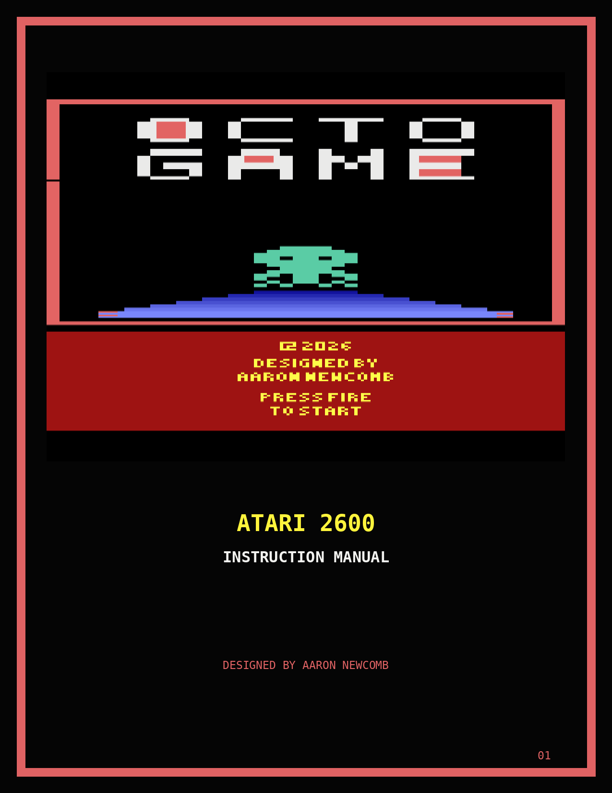
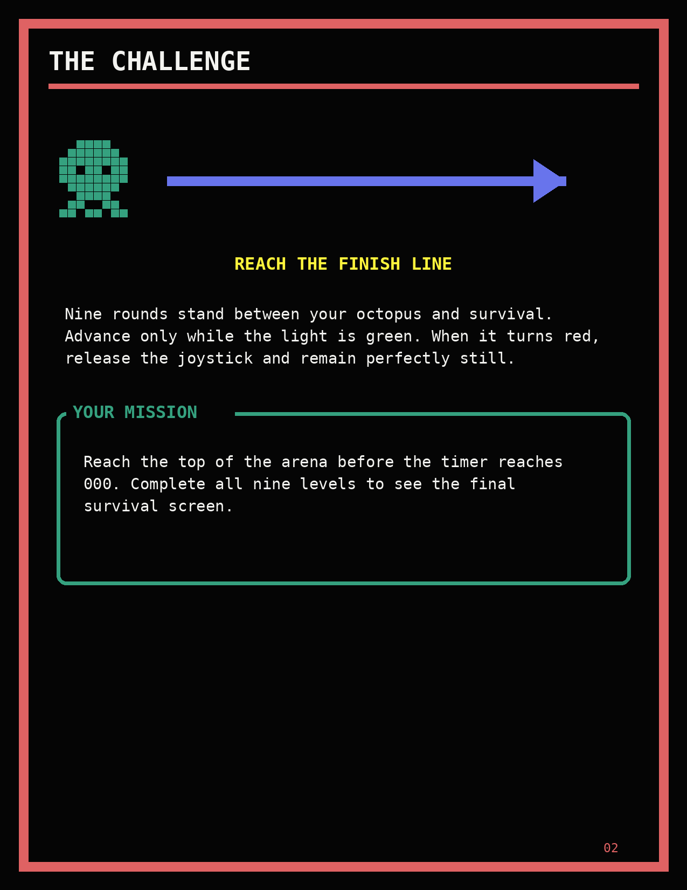
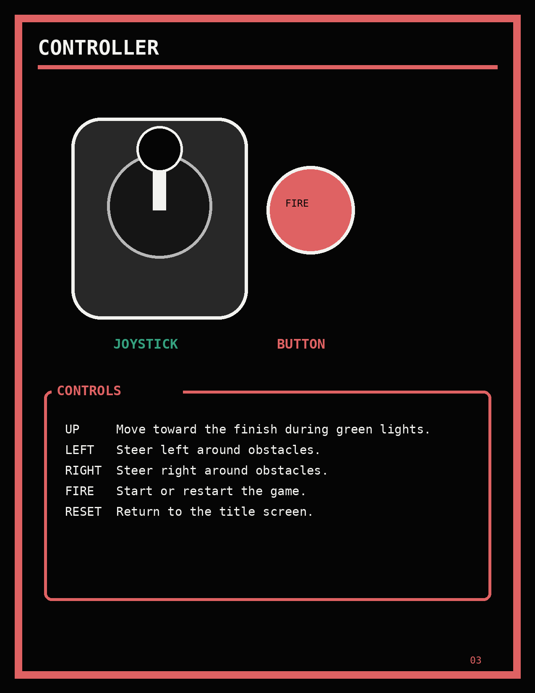
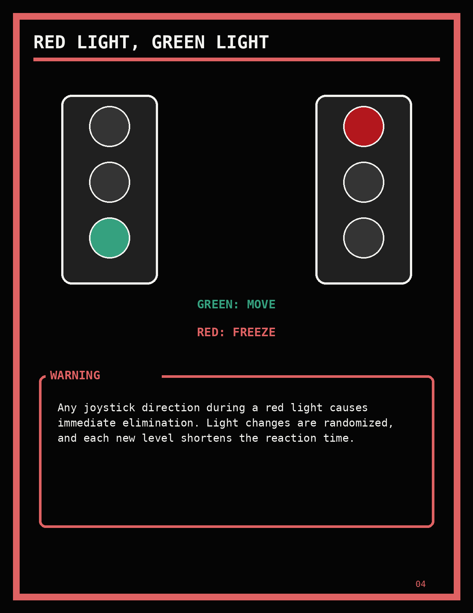
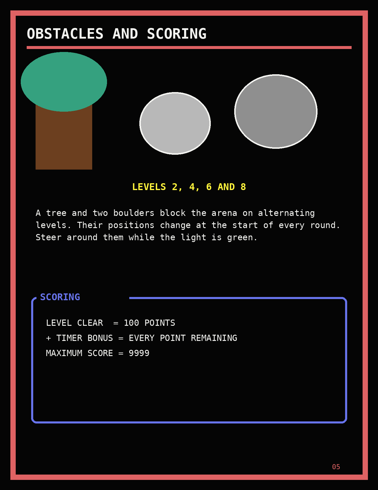
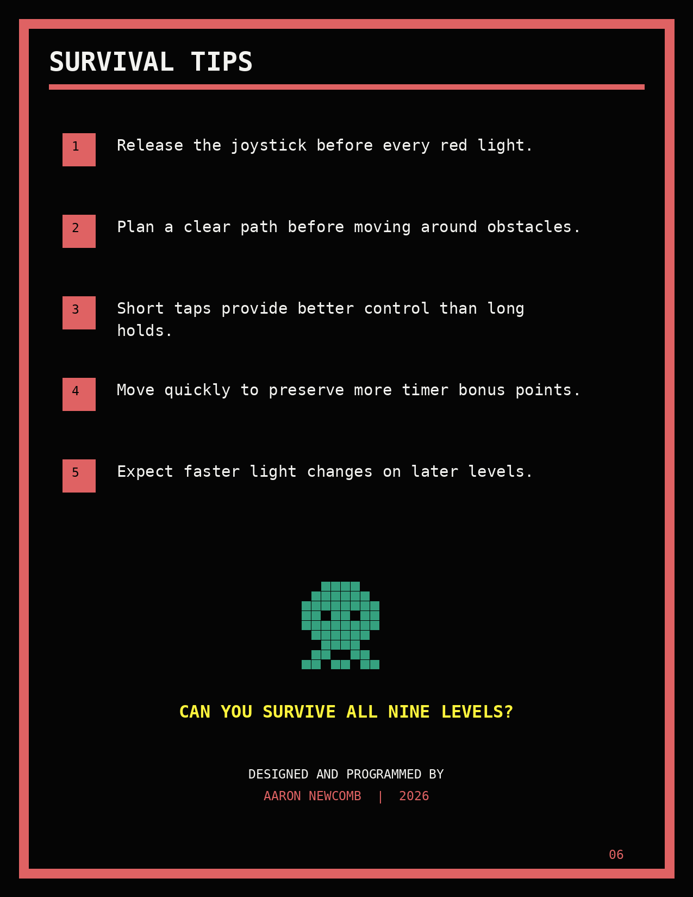

# Octo Game Instruction Manual

[Download the complete PDF manual](manual.pdf)

The manual is presented below one page at a time. Each page image and the PDF
are generated from the same artwork by `scripts/build_manual.py`.

The cover uses the verified v0.3.0 title-screen capture stored in
`docs/assets/title-screen.png`.

## Page 1: Cover



## Page 2: The Challenge



## Page 3: Controller



## Page 4: Red Light, Green Light



## Page 5: Obstacles and Scoring



## Page 6: Survival Tips and Credits



## Rebuilding the manual

Install Pillow and run:

```sh
python3 -m pip install -r requirements-manual.txt
make manual
```
